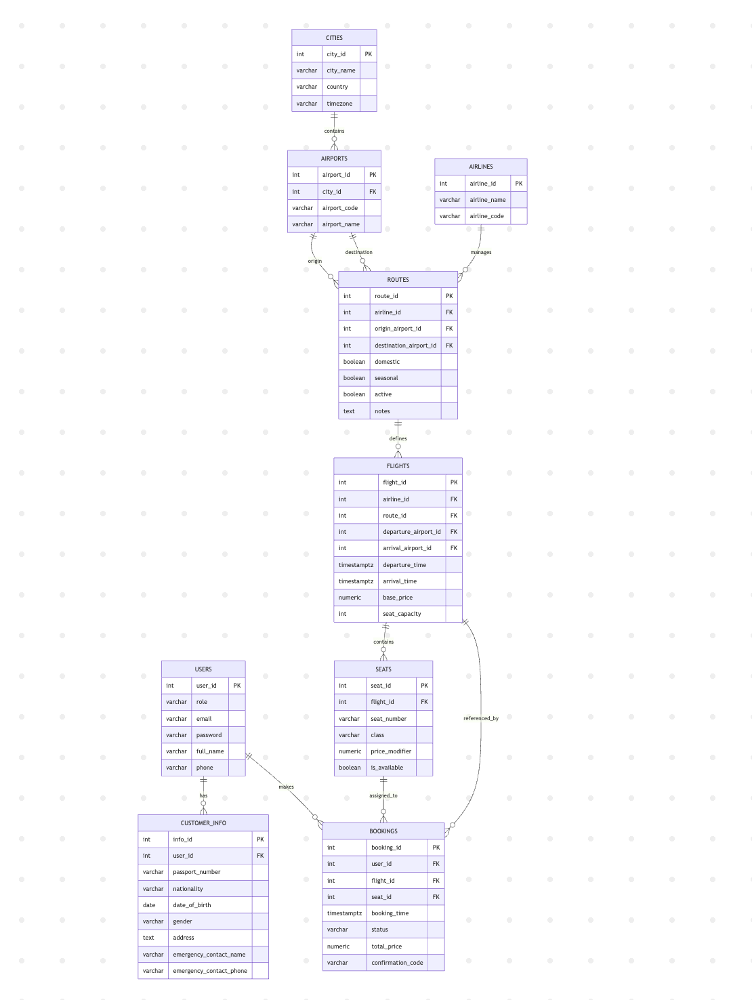

# FlyPorter - Flight Ticket Booking System

Yuan Wang: 1002766526

Yiyang Wang: 1010033278

Zihan Wan: 1011617779

Yiyang Liu: 1011770512

## 1. Motivation

In the digital age, people expect flight booking websites to work quickly and reliably. But many platforms still have problems, especially when lots of people try to book at the same time during holidays or sales. Users run into slow loading times, booking errors, or the site crashing completely when traffic spikes. These issues usually happen because the systems use outdated technology, don't have enough server power, and can't adjust when demand suddenly increases. Without a solid setup, these platforms can't handle many users at once or adapt to changes in traffic, which leads to frustrating experiences and frequent crashes.

FlyPorter is built to fix these problems by creating a modern flight booking platform that runs on the cloud. The project focuses on making sure the system stays stable and responsive even when many people are using it at once, so users can always complete their bookings without issues. By using cloud technology like spreading the workload across multiple servers, storing data reliably, and automatically adjusting resources based on demand, FlyPorter can handle busy periods smoothly and recover quickly if something goes wrong. This not only makes the system more reliable but also keeps everything running well during peak travel times.

FlyPorter is designed for people booking flights within Canada. The main users are business travellers who need quick and reliable booking, students and regular flyers looking for affordable options, and airline staff who manage flight schedules and seat availability. Travellers can easily search for flights, pick their seats, and complete bookings through a simple interface that shows seat availability in real time. Airline staff can add or update flight information quickly, and these changes sync immediately so users always see accurate schedules and seat options.

For airline staff, FlyPorter includes a management dashboard that makes it easy to handle flights and routes. They can create, edit, and update flight details with instant synchronization, ensuring travellers always see the right information. This focus on both travellers and administrators makes FlyPorter practical for real use and good for showing how reliable systems work.

This project is worth building because it shows how cloud-based solutions can solve the problems that older systems have. Many existing platforms still rely on outdated technology and rigid architectures with fixed setups that can't adapt during peak periods, sudden traffic spikes, or when handling access from different regions. FlyPorter, on the other hand, demonstrates the advantages of using the cloud, like being able to scale up or down, having backup systems, and automating processes. Features like load balancing, storing data securely, and monitoring performance help the system run better and last longer.

Overall, FlyPorter aims to create a flight booking system that's both technically solid and easy to use. It shows how cloud computing ideas like scalability, backup systems, and constant availability can turn a regular website into a dependable platform. By improving reliability, speed, and ease of use, FlyPorter creates a better experience for both travellers and staff, while demonstrating how modern cloud technology can solve real problems in online services.

---

## 2. Objective and Key Features

FlyPorter aims to deliver a cloud-native flight booking application that provides a fast and reliable experience for users to search, book, and manage flights. The goal is to design a system that maintains state across deployments and container restarts, integrates payment processing, and runs efficiently on cloud infrastructure using container orchestration.

The application will be structured into three main parts: a React frontend for user interaction, an Express.js backend for core logic and API handling, and a PostgreSQL database for persistent storage. Docker and Docker Compose will be used for local development, while Kubernetes on DigitalOcean will manage orchestration and load balancing. Persistent volumes will be configured to ensure that flight, booking, and user data remain intact across container updates.

### Core Features

* **Docker Containerization and Deployment Provider**

  * Frontend, backend, and PostgreSQL run in separate Docker containers via Docker Compose for local dev.
  * Images are pushed to DigitalOcean Container Registry and deployed on DigitalOcean.
  
* **Orchestration Approach**

  * Use Kubernetes on DigitalOcean (DOKS) to run and scale services.
  * Traffic is routed through a DigitalOcean Load Balancer to the app Services.

* **Authentication and Authorization**

  * Users can register and log in with email and password.
  * The system manages two roles: customer and administrator.
  * Customers can search, book, and manage their own flights, while administrators can add, update, or remove flight listings.
  * Multi-factor authentication (MFA) will be implemented with email verification to add an extra layer of security.

* **Flight Search and Booking**

  * Customers will be able to search for flights based on multiple criteria, such as:

    * Trip type (one-way or round-trip)
    * Departure and arrival dates and times
    * Departure and arrival cities or airports
    * Flight duration
    * Airlines
    * Price range
  * Customers can book available flights and choose their seats once their booking is confirmed.

* **Payment Page**

  * A payment page will be added to handle transactions.
  * Invoices are generated and stored in DigitalOcean Spaces.

* **Booking Management**

  * Customers can view, modify, or cancel their bookings.
  * Updates to bookings will trigger backend operations that ensure consistency between the flight and booking tables in PostgreSQL.

* **Admin Panel**

  * Administrators can manage flights, including creating new routes, adjusting prices, or changing seat availability.
  * The panel is protected by role-based authorization to prevent unauthorized actions.


* **PostgreSQL for flight and booking data**

  * UML and Prisma schema are available in the public GitHub repository:
    [https://github.com/FlyPorter/FlyPorter/tree/main](https://github.com/FlyPorter/FlyPorter/tree/main)
    

The following diagram shows the schema:

```
[users] ───┬───< [customer_info]
            │
            └───< [bookings] >─── [flights] >─── [routes] >─── [airlines]
                                                  │
                                                  └───> [airports] ───> [cities]
                                                     
                     [flights] ───< [seats]
```

* **Persistent Storage**

  * Use PostgreSQL for all state.
  * Attach a DigitalOcean Volume so data survives restarts and updates.

* **Monitoring and Observability**

  * FlyPorter will include a monitoring dashboard using DigitalOcean’s metrics and alerts for CPU, memory, and disk usage.
  * Logs and performance data will help the team ensure reliability during high traffic periods.

### Advanced Features

* **Serverless Intergration: Notifications**

  * When a booking is created, modified, or canceled, the system sends an in-app notification directly to the user dashboard.
  * Notifications are managed through a dedicated database table and displayed using a live WebSocket connection or polling mechanism.

*  **Auto-scaling and High Availability**
  
   *  Run at least 2 replicas of the app; Kubernetes keeps them on different nodes.
   *  Enable autoscaling based on CPU/memory to handle traffic spikes.
  
*  **Deployment and CI/CD**

  * A CI/CD pipeline using GitHub Actions will automate builds, tests, and deployments.
  * Each code push to the main branch will trigger a workflow that rebuilds containers and redeploys the stack.

* **Backup and Recovery**
  * Deploy the database using DigitalOcean Managed Database, which provides automatic daily backups stored securely for the past seven days.
  * For recovery, the system can restore from any of the last seven daily backups, ensuring quick and reliable recovery with minimal downtime.
  
* **Google account login (Integration with external services)**

  * Users can use existing Google accounts to log into FlyPorter.

### Optional Features

**Email Confirmations**

If the core features are implemented before the deadline, the team will work on the following optional features:

When a booking is made or updated, an automated email confirmation will be sent to the user. This integration ensures clear communication and improves the reliability of the booking experience.

---

### System Architecture

The frontend will use React with Tailwind CSS for responsive design. Pages include flight search, booking, payment, user dashboard, and admin management. React Router will provide smooth navigation.

PostgreSQL will be the main database, running in containers with persistent storage on DigitalOcean Volumes. DigitalOcean Spaces will store invoices and related files.

The backend, built with Express.js, handles authentication, booking logic, and notifications. RESTful APIs connect frontend and backend. Notifications are delivered in real time through WebSockets or polling.

Docker and Docker Compose will support local development, while Kubernetes manages orchestration and scaling on DigitalOcean. GitHub Actions will handle CI/CD automation. Monitoring through DigitalOcean metrics and alerts ensures system stability under heavy traffic.

How this meets ECE1779: containerization (Docker), orchestration (Kubernetes), persistent storage (PostgreSQL on DO Volumes), deployment provider (DigitalOcean), observability (metrics/alerts). Advanced features please refer to "Advanced Features" part above (more than 2 advanced features). 

Scope & feasibility: Week 1 core booking, DB schema, auth; Week 2 APIs and UI flows; Week 3 WebSockets, CI/CD, and deployment; Week 4 monitoring, backups, polish, and docs.

---

## 3. Tentative Plan

Each member will focus on a specific area while maintaining close coordination to ensure smooth integration between the frontend, backend, and deployment environments. We will use an agile approach, iterating on development through regular evaluations.

### Yiyang Wang (Database and Backend)

* Design and finalize PostgreSQL schema for all entities
* Implement user authentication and authorization using JWT
* Integrate Google OAuth 2.0 for login with Google accounts
* Implement role-based access control for admin and customer users
* Generate and document APIs using Swagger and export Postman collection
* Implement PDF receipt feature and upload it to DigitalOcean Spaces
* Implement in-app notification API for booking creation, modification, and cancellation
* Containerize backend, frontend, and database with Docker
* Set up Docker Compose for local development

### Zihan Wan (Backend and Deployment)

* Create RESTful APIs for flights, routes, airports, airlines, aircraft, passengers, seats, and tickets
* Implement flight search API with filtering by city, date, airline, and price
* Add input validation middleware for all backend endpoints
* Implement seed scripts to populate sample data
* Ensure persistent data storage using DigitalOcean Volumes
* Configure Kubernetes for production orchestration on DigitalOcean
* Implement CI/CD pipeline using GitHub Actions for automated build, test, and deploy
* Integrate monitoring and alerting via DigitalOcean Metrics Dashboard
* Document deployment steps and provide setup instructions in README

### Yueheng Shi (Frontend Main)

* Develop flight search page with autocomplete, round-trip, and filtering options
* Build seat selection page with visual seat availability and selection logic
* Create booking interface with input validation and confirmation page
* Implement payment page with fake credit card validation (card number, expiry, CVV)
* Add user authentication and registration pages
* Integrate Google login button with backend OAuth flow
* Build user dashboard for viewing, modifying, or canceling bookings
* Implement admin dashboard for managing flights, routes, airlines, airports, and aircraft
* Create navigation bar and sidebar for page transitions
* Display in-app notifications on the user dashboard for booking updates
* Conduct frontend testing and debugging to ensure smooth interactions

---

### Collaboration & Integration

* **Weekly Meeting (Google Meet):** Review progress, plan new tasks, and resolve issues. Frontend and backend will be developed simultaneously, with the frontend team initially using dummy data before backend integration.
* **Version Control (GitHub):** Use feature branches and pull requests to ensure consistency and prevent conflicts.
* **Deployment (DigitalOcean):** Docker Compose for local development and Kubernetes for production deployment once core features are complete.
* **Database Monitoring (DigitalOcean):** Use persistent volumes to ensure data availability after container restarts.
* **Milestone:** By **November 5**, focus on integrating CI/CD, monitoring, and in-app notifications, followed by testing and refinements before submission.

By dividing responsibilities clearly and maintaining consistent communication, the team aims to deliver a complete, cloud-deployed version of FlyPorter that demonstrates containerization, state persistence, orchestration, and monitoring within the course timeframe.
